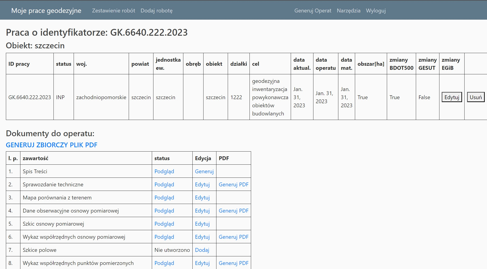

# Geodetic Documentation Generator

## Table of Contents
* [General Info](#general-info)
* [Technologies](#technologies)
* [Setup](#setup)
* [Environment](#env-to-set)
* [Status](#status)
* [Disclaimer](#disclaimer)

## General Info
App to generate technical documentation for land-surveys works. App is prepared for polish land-surveyors.
Add your data and generate one PDF file with whole documentation. This application was made to speed up my own work.

## Technologies
- AWS (EB, EC2, RDS, S3)
- Python 3.9
- Django 4.1.5
- Docker and Docker Compose
- PostgreSQL  
  
**Modules:**  
- xhtml2pdf
- PyPDF2
- pytest
- DRF

## Setup
Go to .docker directory. Put .env file into it.
```bash
run docker compose up --build
```

## .env to set
Environment variables to set:
```
SECRET_KEY=<your secret key>
DEBUG=True
DEV=True
```
If you want to use PostgreSQL please set:
```
"NAME"="YOUR_DATABASE_NAME"
"USER": "YOUR_DATABASE_USER"
"PASSWORD": "YOUR_DATABASE_PASSWORD"
"HOST": "YOUR_DATABASE_HOST"
"PORT": "YOUR_"DATABASE_PORT"
```

## Status:
Project is under construction.
Now we working on add some tools to: height conversion, convert txt files with coordinates.

## Disclaimer
Remember to change WSGI server to Gunicorn server.

## Screenshot

